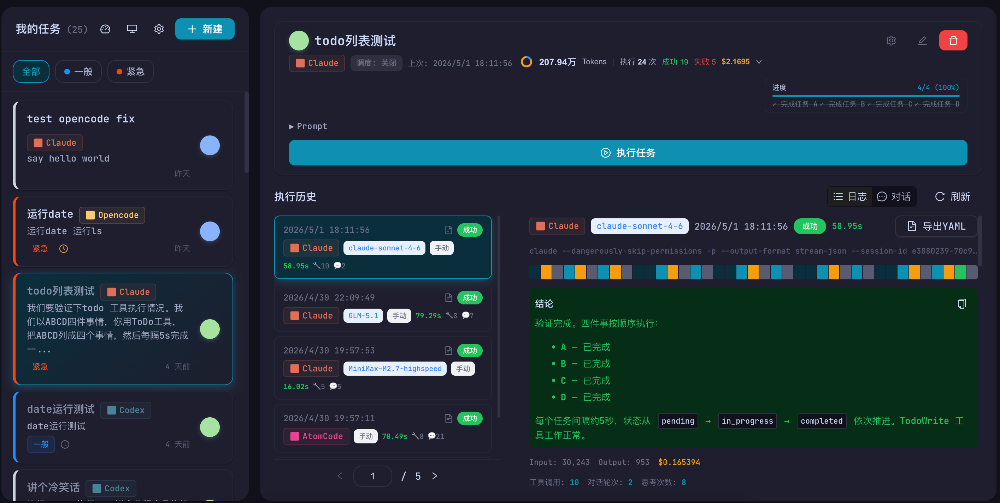

# ntd — Nothing Todo

[](https://github.com/weibaohui/nothing-todo/actions)
[](https://www.npmjs.com/package/@weibaohui/nothing-todo)
[](LICENSE)

**ntd** (Nothing Todo) 是一个 AI 驱动的 Todo 任务管理应用。它将传统的待办事项管理与多 AI 执行器深度集成，让你的任务不仅能被记录，还能被自动执行。

> "无事可做" — 因为 AI 已经帮你做完了。x

---

## 特性

- **智能任务管理** — 创建、编辑、跟踪 Todo，支持多种状态（待办、进行中、已完成、已取消、已归档）
- **多 AI 执行器支持** — 集成 Claude Code、JoinAI、CodeBuddy、OpenCode、AtomCode 等多种 AI CLI 工具
- **可视化仪表盘** — 实时统计任务完成情况，支持趋势图表和数据洞察
- **标签系统** — 灵活的标签分类，快速筛选和定位任务
- **定时调度** — 内置 Cron 调度器，支持定时触发任务执行
- **跨平台** — 支持 Windows、macOS、Linux（x86_64 & ARM64）

---

## 安装

### 方式一：让 AI 帮你安装

将下面的提示词复制给你的 AI 助手（Claude Code、ChatGPT、JoinAI 等）：

```
请在我的电脑上全局安装 ntd (Nothing Todo) 这个工具，执行命令：
npm install -g @weibaohui/nothing-todo
安装完成后运行 ntd 启动服务，然后打开浏览器访问 http://localhost:8088
```

### 方式二：手动安装

需要先安装 [Node.js](https://nodejs.org/) 20+，然后执行：

```bash
npm install -g @weibaohui/nothing-todo
```

---

## 使用

```bash
# 启动服务
ntd

# 打开浏览器访问
# http://localhost:8088
```

### 命令行

```bash
ntd              # 启动服务（默认端口 8088）
ntd version      # 查看版本信息
ntd upgrade      # 升级到最新版本
ntd --help       # 查看帮助
```

### 升级

```bash
ntd upgrade
# 或手动执行
npm install -g @weibaohui/nothing-todo@latest
```

---

## 支持的 AI 执行器

| 执行器 | 说明 |
|--------|------|
| [Claude Code](https://docs.anthropic.com/en/docs/claude-code/overview) | Anthropic 官方 CLI |
| JoinAI | AI 工作流工具 |
| CodeBuddy | 代码助手 |
| OpenCode | 开源代码助手 |
| AtomCode | AI 代码编辑器 |

---




---

## 开发

参与开发请参阅 [DEVELOPMENT.md](DEVELOPMENT.md)。

## 许可证

[Polyform](LICENSE)

---

<p align="center">
  用 Rust + React + AI 打造 | 让待办事项真正被「执行」
</p>
