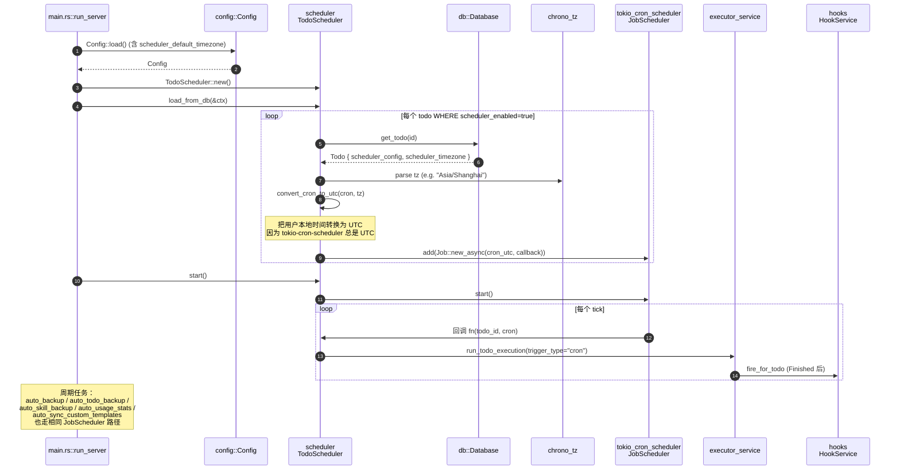
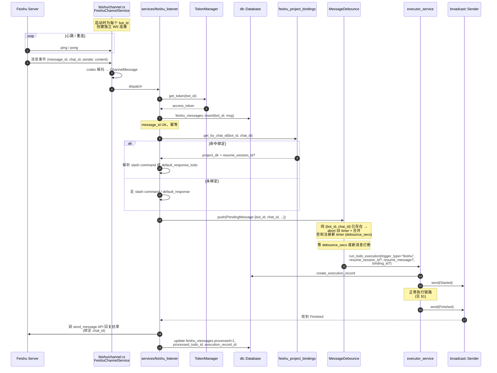
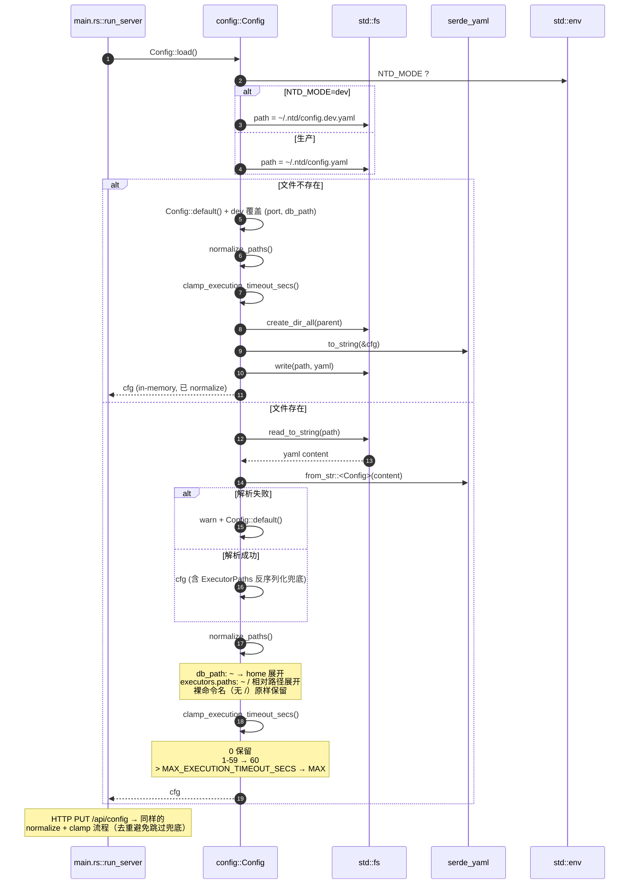
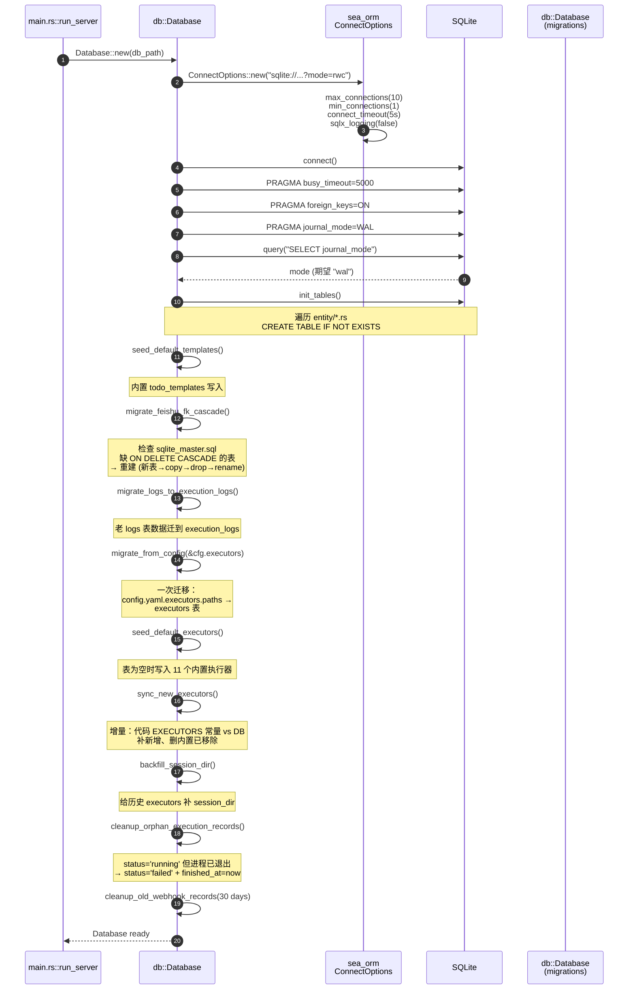

# ntd Backend 关键流程时序图

> 配套文档：[README.md](./README.md) · [ARCHITECTURE.md](./ARCHITECTURE.md) · [CONFIG.md](./CONFIG.md)

本文档用 mermaid `sequenceDiagram` 描述 5 个最关键的业务流程。每个图都标注了：
- 涉及模块
- 关键边界（超时 / 并发上限 / 取消 / 失败兜底）
- 与其他流程的衔接点

---

## 1. 执行 Todo 的端到端流程

**触发方式**：HTTP `POST /api/execute` 或 CLI `ntd todo execute`，亦可由 cron / webhook / 飞书 / hook 派生。

```mermaid
sequenceDiagram
    autonumber
    actor Client as 前端 / CLI
    participant H as handlers/execution.rs<br/>start_todo_execution
    participant ES as executor_service<br/>run_todo_execution
    participant TM as task_manager<br/>TaskManager
    participant REG as adapters<br/>ExecutorRegistry
    participant DB as db::Database
    participant TX as broadcast::Sender<br/>ExecEvent
    participant CG as command-group<br/>AsyncGroupChild
    participant Hook as hooks<br/>HookService
    participant WS as WebSocket<br/>前端

    Client->>H: POST /api/execute {todo_id, message, executor?}
    H->>ES: RunTodoExecutionRequest { ... }

    ES->>TM: register(task_id)
    TM-->>ES: cancel_rx (mpsc::Receiver)

    ES->>DB: get_todo(todo_id)
    DB-->>ES: Todo { executor?, ... }

    Note over ES: 并发上限检查<br/>count(running records for todo_id)<br/>&lt; max_concurrent_todos

    ES->>REG: get_or_default(executor_req | todo.executor | default)
    REG-->>ES: Arc<dyn CodeExecutor>

    ES->>DB: create_execution_record(status=Running)
    DB-->>ES: record_id

    ES->>TX: send(Started {task_id, todo_id, executor})
    TX-->>WS: 推前端

    par 子进程 + 日志解析
        ES->>CG: spawn(cli binary + args)
        CG-->>ES: child (pgid set)

        loop 每行 stdout/stderr
            CG-->>ES: BufReader line
            ES->>ES: parse → ParsedLogEntry
            ES->>DB: append execution_log
            ES->>TX: send(Output {entry})
            TX-->>WS: 推前端
        end

        ES->>CG: wait_with_output + timeout(execution_timeout_secs)
    and 取消监听
        TM->>ES: cancel_rx.recv() (用户取消)
        ES->>CG: kill() (整个进程组)
    end

    alt 正常完成
        CG-->>ES: ExitStatus::success()
        ES->>DB: update_execution_record(status=Success)
        ES->>TX: send(Finished {success=true})
    else 超时
        Note over ES: tokio timeout 触发
        ES->>CG: kill()
        ES->>DB: update_execution_record(status=Timeout)
        ES->>TX: send(Finished {success=false, "timeout"})
    else 取消
        ES->>DB: update_execution_record(status=Cancelled)
        ES->>TX: send(Finished {success=false, "cancelled by user"})
    else 进程失败
        CG-->>ES: ExitStatus::failure / spawn error
        ES->>DB: update_execution_record(status=Failed, stderr)
        ES->>TX: send(Finished {success=false})
    end

    ES->>Hook: fire_for_todo(todo_id, Finished)
    Note over Hook: 异步 tokio::spawn，<br/>读 parent.hooks 触发子 todo

    ES->>TM: remove(task_id)
    TX-->>WS: Finished 事件
```

**关键边界**：
- 并发上限检查用 `task_manager.get_all_task_infos()` 过滤掉僵尸记录（status=running 但 task_manager 不存在）。
- 取消信号通过 `mpsc` 通道送达；不要在阻塞 future 中 `recv`，要 `tokio::select!` 与子进程等待并列。
- 失败兜底：进程崩溃 / spawn 失败 / BufReader EOF 都要把 status 写到 DB；否则前端永远看到 Running。

---

## 2. Cron 调度工作流程

**触发方式**：`make dev` / `make install` 后由 ntd daemon 启动 ntd 服务，scheduler 随之初始化。



**关键边界**：
- `convert_cron_to_utc` 仅处理 hours 字段；`*` / 单值 / `9-17` / `*/2` 中除 `*/2` 外都正确换算。
- 调度器重启时 JobScheduler 不会保留跨进程状态，必须重新从 DB 加载。
- `tz=None` 视为 UTC。

---

## 3. 飞书消息处理流程

**触发方式**：某个 `agent_bots.app_id` 配置开启后，ntd 启动时建立 WebSocket 长连接。



**关键边界**：
- 同 `(bot_id, chat_id)` 短时间内多消息只触发一次执行；合并逻辑保留最后一条 + 历史摘要。
- `feishu_messages.message_id` 是 unique，重复投递走幂等分支不重复执行。
- `history_message_max_age_secs`（默认 600）控制历史回溯多久的消息还会被处理；超过的标 `is_history=1` 跳过。
- Token 由 `TokenManager` 缓存，过期前自动刷新；冷启动时同步获取。

---

## 4. 配置加载流程

**触发方式**：每次 `ntd` 启动时 `Config::load()`。



**关键边界**：
- 用户直接编辑 `~/.ntd/config.yaml` 时 `clamp_execution_timeout_secs` 是唯一兜底（HTTP 路径用 `validate_execution_timeout_secs`）。
- `ExecutorPaths` 反序列化兼容两种 schema：`{paths: {...}}` 和老版本直接 `{...}`，避免历史配置文件升级失败。
- 配置文件写入用 `temp + rename` 原子替换；崩溃时不会留下半截 YAML。

---

## 5. 数据库初始化流程

**触发方式**：`Database::new(path)`。



**关键边界**：
- `PRAGMA foreign_keys=ON` 必须显式开，SQLite 默认 OFF。
- WAL 模式下允许多读单写；`max_connections=10` 是 SQLite + SeaORM 的安全上限。
- `migrate_feishu_fk_cascade` 用事务包住整个重建过程；失败回滚不留半截表。
- 增量迁移（`sync_new_executors`）让代码升级时自动同步 DB，不会让新 executor 缺失。

---

## 附录：模块路径速查

| 流程 | 入口模块 | 关键函数 |
|------|---------|---------|
| Todo 执行 | `handlers::execution::start_todo_execution` | `executor_service::run_todo_execution` |
| Cron 调度 | `scheduler::TodoScheduler::load_from_db` | `scheduler::convert_cron_to_utc` |
| 飞书消息 | `services::feishu_listener::on_message` | `services::message_debounce::push` |
| 配置加载 | `config::Config::load` | `normalize_paths` / `clamp_execution_timeout_secs` |
| DB 初始化 | `db::Database::new` | `migrate_feishu_fk_cascade` / `sync_new_executors` |
